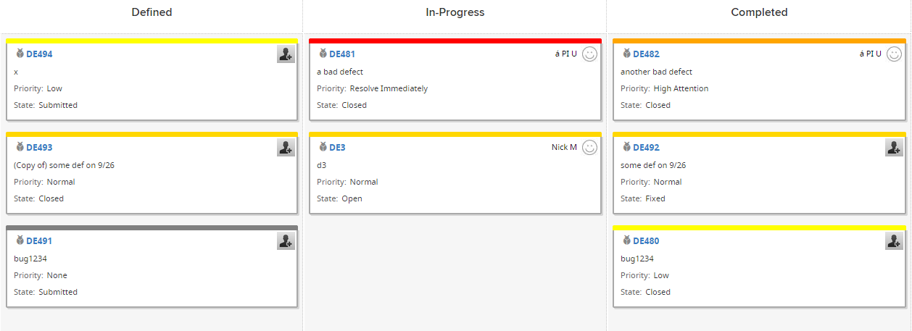

Defects Board With Custom Card
=========================

## Overview
In this example[Rally.ui.cardboard.CardView](https://help.rallydev.com/apps/2.0rc3/doc/#!/api/Rally.ui.cardboard.Card) is extended so that a defect card color changes based on Priority:

This app is available on AS IS basis. It is not supported by Rally support.
## License

AppTemplate is released under the MIT license.  See the file [LICENSE](./LICENSE) for the full text.

##Documentation for SDK

You can find the documentation on our help [site.](https://help.rallydev.com/apps/2.0rc3/doc/)
